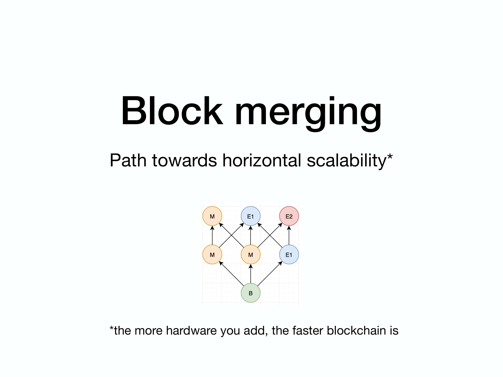
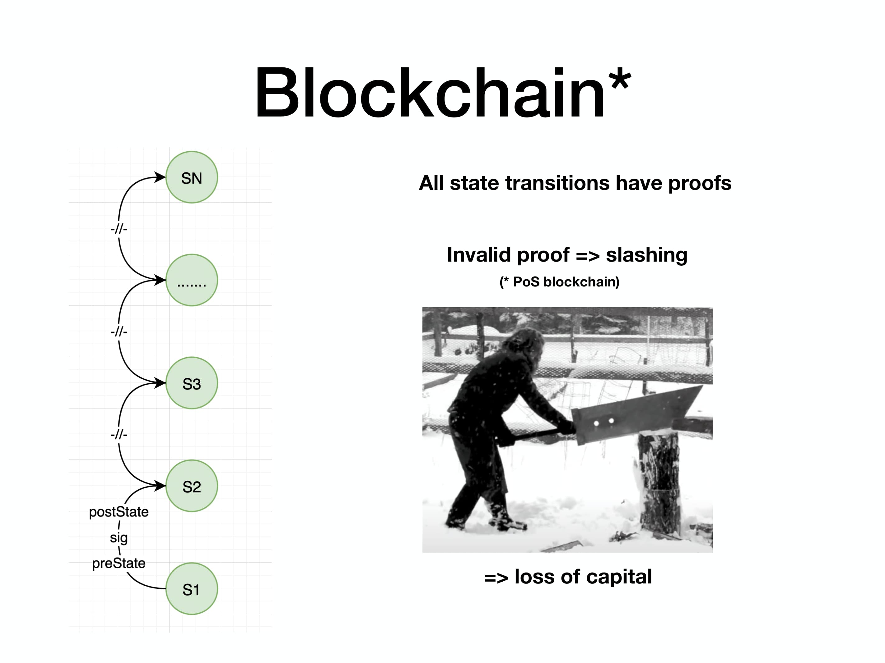
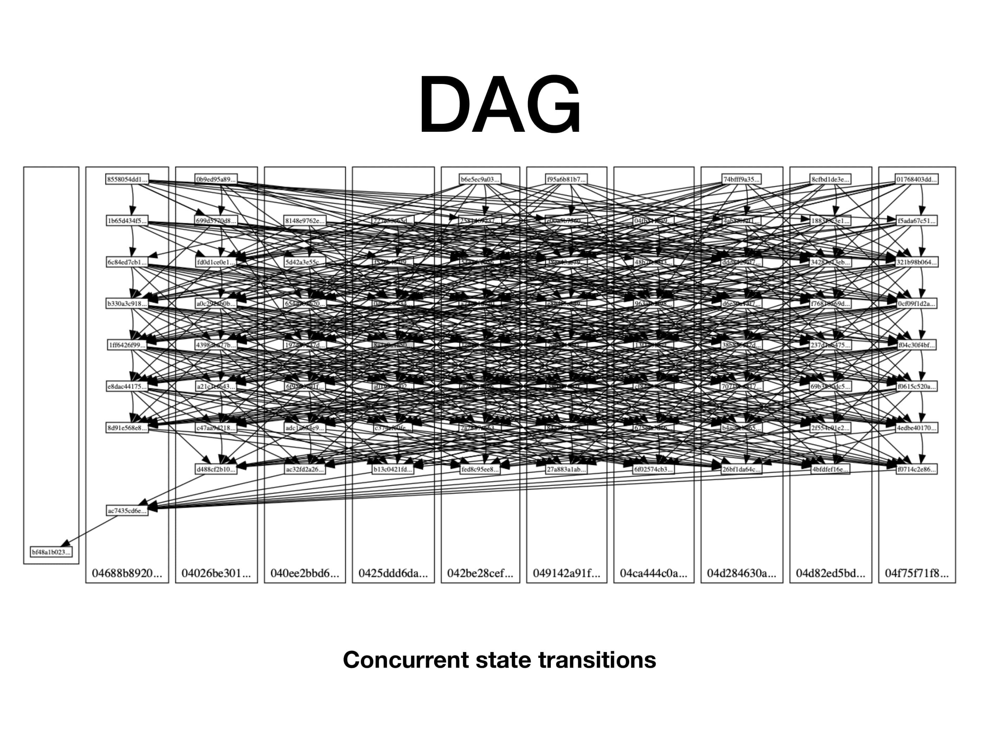
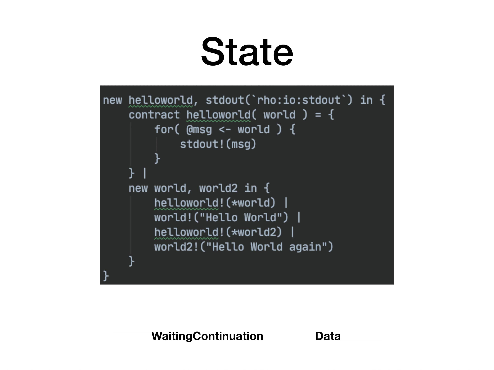
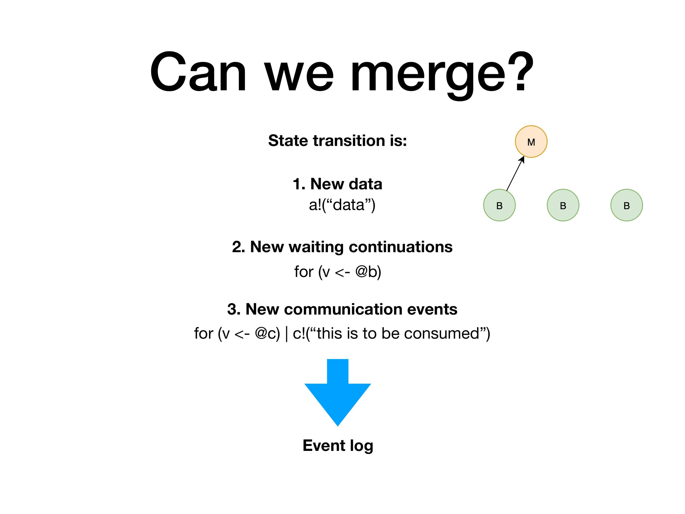
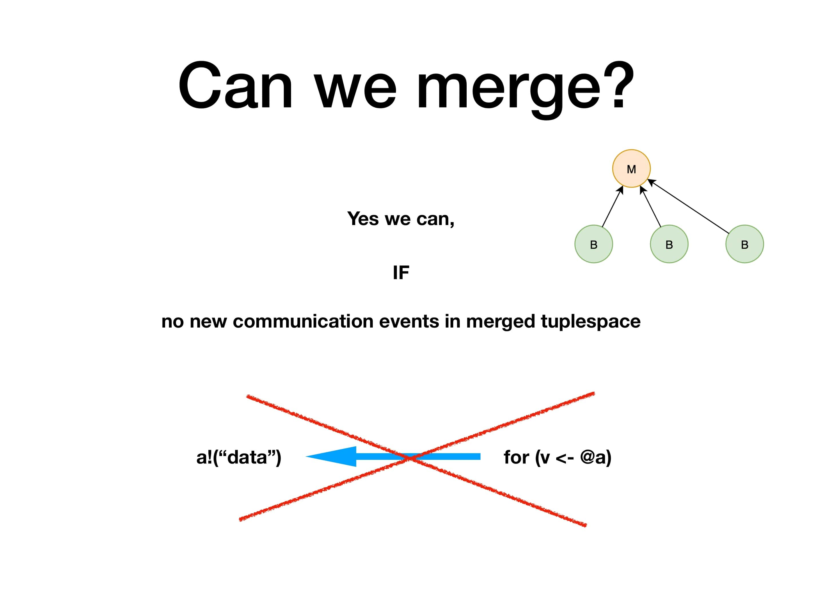
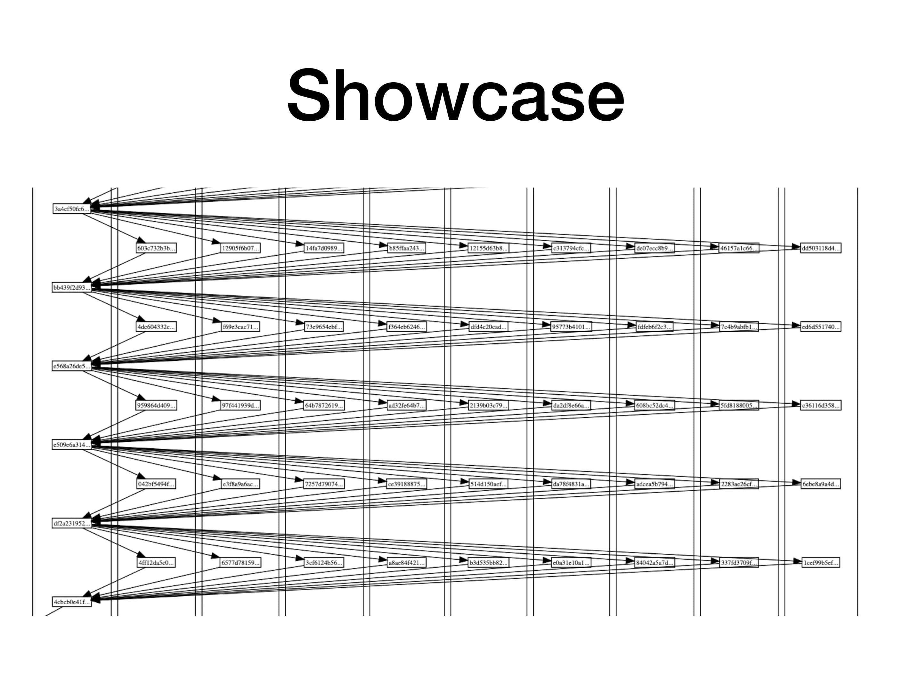
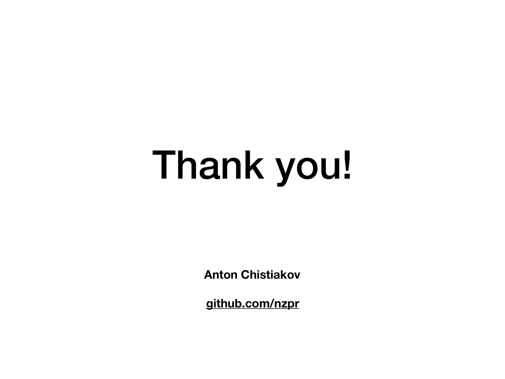

Blockchain is all about storing a state. But with blockchain the current state is not decided by a single entity. That means you have to have a consensus about what the current state is in such a way, that nobody can cheat the system and makes state changes (like double spending money) which are harmfull for others. Blockchain 1.0 like Bitcoin are running all transaction in a chain and every validator has to see it. Blockchain 2.0 is using a dag structure (directed acyclic graph) and POS (proof of stake) but also every validator has to validate the work.

With Blockchain 3.0 like Rchain, which is building on the concurrent rho-calculus, there is concurrency built into the protocoll. With this the network is not only producing a directed acyclic graph block structure, where the state is saved, it is also possible to make a last finalized state proof. With that the network can remove transactions from the past. Think about it like a new genenesis block which is beeing generated. This feature to forget transactions, but having a consistent state is completely new and no other current blockchain platform has this possability. Additionaly every validator can produce new block, with transaction in it. With blockmerge all these local directed acyclic graphs can be merged together to one. This makes the network linearly scale with additonaly hardware and nodes. This is also a feature no other blockchain network has currently.

The following slide show how blockmerge is working:

This image below, shows the current state of blockmerge in testing. In this image there are 10 validator, which are receiving transaction from each other and are validating these.

